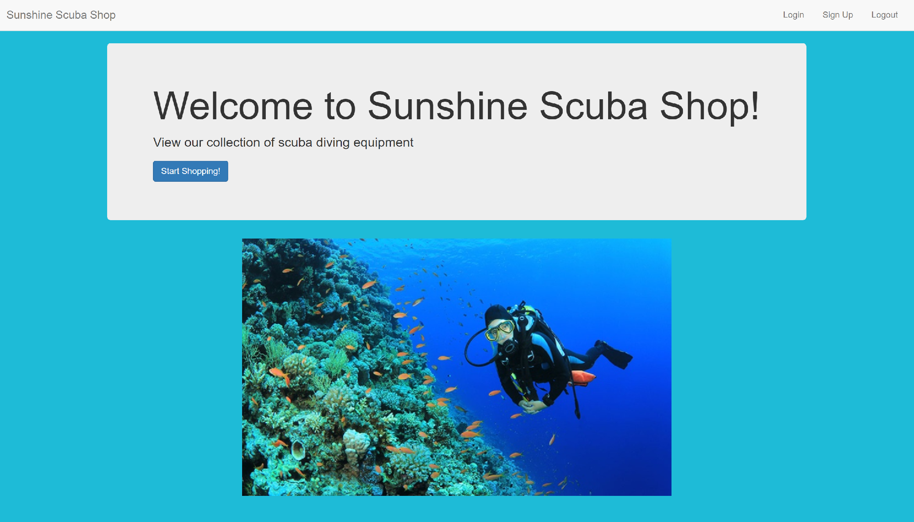

## Introduction
This is a Scuba Diving Equipment store website for Database Design Course

Functionalities included:
- Shop for products as a guest or user
- Add, delete, and update product and product quantity in shopping cart
- Login (save your shopping order)
- View order total and checkout

Admin privileges:
- Add, delete, update products and product quantity in inventory

## Installation

`npm install`

## Running

1) Make sure XAMPP is installed and MySQL and Apache are running

2) `nodemon app.js`

3) Go to http://localhost:3000

4) In order to access admin (employee) pages, go to http://localhost:3000/admin

## ------Other Options-------
* to access phpMyAdmin, go to http://localhost/
